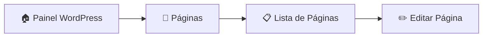
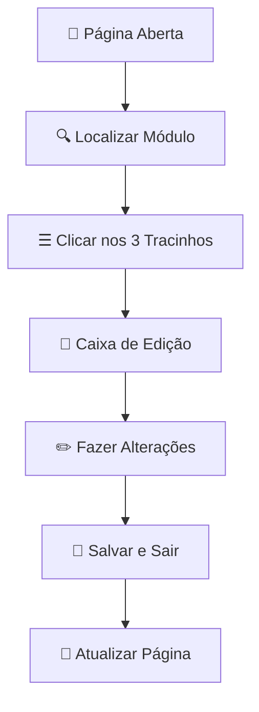

# 📄 Alterar Páginas do Site

!!! warning "Perfil: Administrador"
    Este guia é destinado a usuários com perfil de **Administrador** no WordPress.

[:material-arrow-left: Voltar para Central de Publicações](central-publicacoes.md)

!!! danger "Atenção"
    O perfil de Administrador tem acesso total ao sistema. Use com responsabilidade.

---

## 📋 Passo a Passo

### :material-numeric-1-circle:{ .lg } Passo 1: Acessar Páginas

??? example "Como navegar até Páginas"
    1. No painel de controle do WordPress
    2. Na **barra lateral esquerda**, clique em **"Páginas"**
    3. Localize a página que deseja editar na lista

| Ação | Localização | Ícone |
|------|-------------|-------|
| **Páginas** | Barra lateral esquerda | :material-file-document-multiple: |
| **Editar** | Abaixo do título da página | :material-pencil: |

---

### :material-numeric-3-circle:{ .lg } Passo 3: Selecionar e Editar

??? success "Como selecionar a página para edição"
    
    1. Na lista de páginas, localize a página desejada
    2. Passe o mouse sobre o título da página
    3. Clique em **"Editar"** (aparece abaixo do título)

!!! tip "Dica"
    Use a barra de busca no topo da lista para encontrar páginas rapidamente pelo nome.

---

### :material-numeric-4-circle:{ .lg } Passo 4: Editar com o Construtor Divi

Dentro da página, o conteúdo é organizado em **módulos**. Para editar qualquer elemento:

??? example "Como editar um módulo"
    
    1. Localize o módulo que deseja editar (texto, imagem, banner, etc.)
    2. Passe o mouse sobre o módulo
    3. Clique nos **três tracinhos** (:material-menu:) no módulo cinza
    4. Uma nova caixa de edição será aberta
    5. Faça as alterações necessárias
    6. Clique em **"Salvar e Sair"**

#### Tipos de Módulos Editáveis

| Módulo | Descrição | Elementos Editáveis |
|--------|-----------|---------------------|
| **Texto** | Blocos de texto | Conteúdo, fonte, cor, tamanho |
| **Imagem** | Fotos e gráficos | Imagem, tamanho, link, alt |
| **Banner** | Banners promocionais | Imagem, texto, link, animação |
| **Botão** | Botões de ação | Texto, link, cor, estilo |
| **Vídeo** | Vídeos incorporados | URL, tamanho, autoplay |
| **Galeria** | Galerias de imagens | Imagens, layout, navegação |

---

### :material-numeric-5-circle:{ .lg } Passo 5: Salvar as Alterações

!!! warning "Importante"
    Após fazer todas as alterações nos módulos, você **deve atualizar a página** para que as mudanças sejam publicadas.

??? success "Como salvar e publicar"
    
    1. Certifique-se de ter clicado em **"Salvar e Sair"** em cada módulo editado
    2. No **menu à direita**, clique em **"Atualizar"**
    3. Aguarde a confirmação de que a página foi atualizada

| Ação | Localização | Resultado |
|------|-------------|-----------|
| **Salvar e Sair** | Dentro do módulo | Salva alterações do módulo |
| **Atualizar** | Menu lateral direito | Publica todas as alterações |

---

## 📊 Resumo do Processo

| Etapa | Ação | Local |
|-------|------|-------|
| 1 | Login como Administrador | /restrito |
| 2 | Clicar em **Páginas** | Menu lateral esquerdo |
| 3 | Clicar em **Editar** na página | Lista de páginas |
| 4 | Clicar nos **3 tracinhos** do módulo | Dentro da página |
| 5 | Fazer alterações | Caixa de edição |
| 6 | Clicar em **Salvar e Sair** | Caixa de edição |
| 7 | Clicar em **Atualizar** | Menu lateral direito |

---

## ⚠️ Cuidados Importantes

!!! danger "Antes de Editar"
    - Tenha certeza de qual página está editando
    - Faça backup mental do conteúdo original
    - Teste as alterações antes de sair da página

!!! tip "Boas Práticas"
    - Edite uma seção por vez
    - Salve frequentemente
    - Visualize a página após atualizar para confirmar as mudanças

---

## ❓ Dúvidas Frequentes

??? question "Posso desfazer uma alteração?"
    O WordPress mantém um histórico de revisões. Acesse **"Revisões"** no menu lateral direito para restaurar versões anteriores.

??? question "As alterações são publicadas imediatamente?"
    Sim, ao clicar em **"Atualizar"**, as alterações ficam visíveis no site imediatamente.

??? question "O que fazer se algo der errado?"
    Use o histórico de **Revisões** para restaurar uma versão anterior da página ou entre em contato com o suporte técnico.

---

[:material-arrow-left: Voltar para Central de Publicações](central-publicacoes.md)
