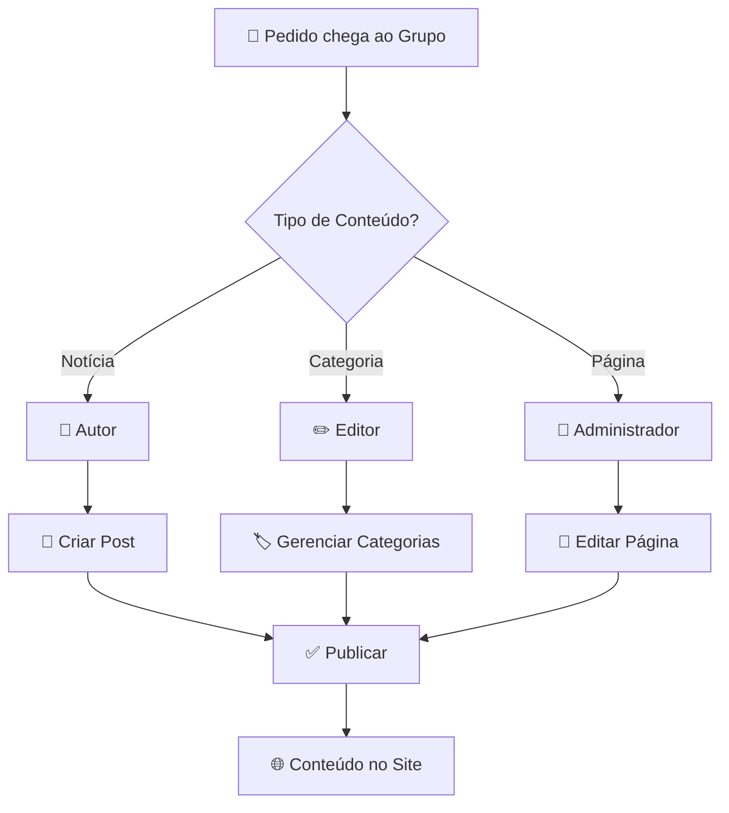

# 🌐 Central de Publicações

Bem-vindo à **Central de Publicações** do site da Revista Têxtil. Este é o ponto de partida para todas as operações de publicação de conteúdo no WordPress.

---

## 🎯 Antes de Começar

!!! warning "Leitura Obrigatória para Iniciantes"
    Se você é novo na equipe ou nunca publicou conteúdo no site, leia esta seção com atenção antes de realizar qualquer operação.

### Responsabilidades

Publicar conteúdo no site da Revista Têxtil é uma **responsabilidade importante**. Todo conteúdo publicado representa a marca e deve seguir nossos padrões de qualidade.

-   :material-check-circle:{ .lg .middle } **Verificar**

    ---

    Sempre revise o conteúdo antes de publicar

-   :material-shield-check:{ .lg .middle } **Validar**

    ---

    Confirme informações, nomes e dados

-   :material-eye-check:{ .lg .middle } **Visualizar**

    ---

    Use a pré-visualização antes de publicar

-   :material-account-check:{ .lg .middle } **Responsabilizar**

    ---

    Você é responsável pelo que publica

---

## 📋 Fluxo de Operação

### Como funciona o processo de publicação

### Etapas do Processo

| Etapa | Descrição | Responsável |
|-------|-----------|-------------|
| **1. Solicitação** | Pedido de publicação chega ao grupo | Solicitante |
| **2. Triagem** | Identificar tipo de conteúdo e perfil necessário | Editor-Chefe |
| **3. Execução** | Realizar a publicação conforme o guia | Autor/Editor/Admin |
| **4. Verificação** | Confirmar que o conteúdo está correto no site | Responsável |

---

## 👥 Perfis e Permissões

Cada perfil tem permissões específicas no WordPress:

| Perfil | Pode Fazer | Não Pode Fazer |
|--------|------------|----------------|
| :material-account-edit: **Autor** | Criar e editar próprios posts | Editar posts de outros, gerenciar categorias |
| :material-account-star: **Editor** | Editar todos os posts, gerenciar categorias | Alterar páginas, configurações do site |
| :material-shield-account: **Administrador** | Acesso total ao sistema | — |

---

## 🔐 Acesso ao Sistema

### Informações de Login

| Campo | Valor |
|-------|-------|
| **URL** | `revistatextil.com.br/restrito` |
| **Usuário** | Seu e-mail corporativo |
| **Senha** | Fornecida pelo administrador |

??? tip "Dicas de Segurança"
    - **Nunca compartilhe** suas credenciais
    - **Altere sua senha** se suspeitar de comprometimento
    - **Faça logout** ao terminar em computadores compartilhados
    - **Use senhas fortes** com letras, números e símbolos

---

## 📚 Guias Disponíveis

Escolha o guia de acordo com sua necessidade:

-   :material-newspaper:{ .lg .middle } **Publicar Notícias**

    ---

    Criar e publicar posts de notícias no site
    
    **Perfil:** Autor
    
    [:octicons-arrow-right-24: Acessar guia](publicar-noticias.md)

-   :material-tag-multiple:{ .lg .middle } **Configurar Categorias**

    ---

    Adicionar, editar ou excluir categorias de posts
    
    **Perfil:** Editor
    
    [:octicons-arrow-right-24: Acessar guia](configurar-categorias.md)

-   :material-file-document-edit:{ .lg .middle } **Alterar Páginas**

    ---

    Editar páginas existentes do site
    
    **Perfil:** Administrador
    
    [:octicons-arrow-right-24: Acessar guia](alterar-paginas.md)

---

## ✅ Checklist de Verificação

Antes de publicar qualquer conteúdo, verifique:

### Para Notícias

- [ ] Título claro e objetivo
- [ ] Texto revisado (ortografia e gramática)
- [ ] Informações verificadas e corretas
- [ ] Imagens com créditos
- [ ] Categoria correta selecionada
- [ ] Pré-visualização conferida

### Para Páginas

- [ ] Alterações necessárias identificadas
- [ ] Backup mental do conteúdo original
- [ ] Módulos editados corretamente
- [ ] "Salvar e Sair" clicado em cada módulo
- [ ] "Atualizar" clicado para publicar
- [ ] Página verificada após publicação

---

## 🏷️ Categorias do Site

As categorias organizam o conteúdo do site:

| Categoria | Uso |
|-----------|-----|
| **Notícias** | Informações gerais do setor têxtil |
| **Eventos** | Feiras, congressos e encontros |
| **Tecnologia** | Inovações e tendências tecnológicas |
| **Sustentabilidade** | Práticas sustentáveis e ESG |
| **Mercado** | Análises econômicas e de negócios |
| **Entrevistas** | Perfis e conversas com profissionais |

---

## ❓ Dúvidas Frequentes

??? question "Qual perfil eu preciso para publicar uma notícia?"
    Você precisa do perfil de **Autor** ou superior (Editor, Administrador).

??? question "Posso editar uma notícia depois de publicada?"
    Sim! Acesse Posts, localize a notícia e clique em "Editar".

??? question "Como sei se minha publicação está no ar?"
    Após publicar, acesse o site e verifique se o conteúdo aparece corretamente.

??? question "O que fazer se cometer um erro?"
    - **Posts:** Edite e atualize imediatamente
    - **Páginas:** Use o histórico de Revisões para restaurar
    - **Dúvidas:** Contate o suporte técnico

??? question "Quem pode me dar acesso ao sistema?"
    Entre em contato com o administrador do site ou a equipe de TI.

---

## 🆘 Suporte

-   :material-email:{ .lg .middle } **E-mail**

    ---

    suporte@revistatextil.com.br

-   :material-phone:{ .lg .middle } **Telefone**

    ---

    Ramal interno: 123

---

  <strong>Revista Têxtil</strong> — Central de Publicações 🧵

