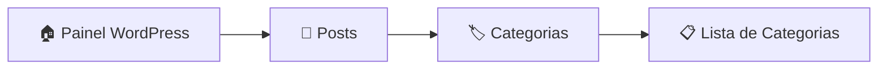

# 🏷️ Configurar Categorias

!!! info "Perfil: Editor"
    Este guia é destinado a usuários com perfil de **Editor** no WordPress.

[:material-arrow-left: Voltar para Central de Publicações](central-publicacoes.md)

---

## 📋 Passo a Passo

### :material-numeric-1-circle:{ .lg } Passo 1: Acessar Categorias

??? example "Como navegar até Categorias"
    1. No painel de controle do WordPress
    2. Na **barra lateral esquerda**, clique em **"Posts"**
    3. Clique em **"Categorias"**

| Ação | Localização | Ícone |
|------|-------------|-------|
| **Posts** | Barra lateral esquerda | :material-file-document: |
| **Categorias** | Submenu de Posts | :material-tag-multiple: |

---

### :material-numeric-3-circle:{ .lg } Passo 3: Gerenciar Categorias

A página de categorias permite três ações principais:

#### :material-plus-circle: Adicionar Nova Categoria

??? success "Como adicionar uma categoria"
    
    1. Na página de Categorias, localize o formulário à **esquerda**
    2. Preencha os campos:
        - **Nome:** Nome da categoria (ex: "Tecnologia")
        - **Slug:** URL amigável (ex: "tecnologia")
        - **Categoria pai:** Se for subcategoria, selecione a categoria pai
        - **Descrição:** Breve descrição (opcional)
    3. Clique em **"Adicionar nova categoria"**

| Campo | Obrigatório | Exemplo |
|-------|-------------|---------|
| **Nome** | ✅ Sim | Sustentabilidade |
| **Slug** | Não (gerado automaticamente) | sustentabilidade |
| **Categoria pai** | Não | Nenhuma |
| **Descrição** | Não | Notícias sobre práticas sustentáveis |

---

#### :material-pencil: Editar Categoria Existente

??? example "Como editar uma categoria"
    
    1. Na lista de categorias à **direita**, localize a categoria desejada
    2. Passe o mouse sobre o nome da categoria
    3. Clique em **"Editar"**
    4. Faça as alterações necessárias
    5. Clique em **"Atualizar"**

| Ação | Descrição |
|------|-----------|
| :material-pencil: **Editar** | Abre a categoria para edição completa |
| :material-pencil-outline: **Edição rápida** | Edita apenas o nome e slug inline |
| :material-eye: **Ver** | Visualiza posts da categoria no site |

---

#### :material-delete: Excluir Categoria

??? warning "Como excluir uma categoria"
    
    1. Na lista de categorias, localize a categoria desejada
    2. Passe o mouse sobre o nome da categoria
    3. Clique em **"Excluir"**
    4. Confirme a exclusão

!!! danger "Atenção"
    Ao excluir uma categoria, os posts associados a ela **não serão excluídos**, mas serão movidos para a categoria padrão (geralmente "Sem categoria").

---

## 📊 Categorias Padrão do Site

| Categoria | Descrição | Uso |
|-----------|-----------|-----|
| **Notícias** | Informações gerais do setor | Posts de notícias gerais |
| **Eventos** | Feiras, congressos e encontros | Cobertura de eventos |
| **Tecnologia** | Inovações e tendências | Novidades tecnológicas |
| **Sustentabilidade** | Práticas sustentáveis | Meio ambiente e ESG |
| **Mercado** | Análises e dados | Economia e negócios |
| **Entrevistas** | Conversas com profissionais | Perfis e entrevistas |

---

## 📋 Resumo das Ações

| Ação | Caminho | Resultado |
|------|---------|-----------|
| **Adicionar** | Posts → Categorias → Formulário | Nova categoria criada |
| **Editar** | Posts → Categorias → [Categoria] → Editar | Categoria modificada |
| **Excluir** | Posts → Categorias → [Categoria] → Excluir | Categoria removida |
| **Visualizar** | Posts → Categorias → [Categoria] → Ver | Posts da categoria |

---

## ❓ Dúvidas Frequentes

??? question "Posso criar subcategorias?"
    Sim! Ao criar ou editar uma categoria, selecione uma **"Categoria pai"** para criar uma hierarquia.

??? question "O que acontece com os posts ao excluir uma categoria?"
    Os posts são movidos para a categoria padrão. Nenhum conteúdo é perdido.

??? question "Posso renomear uma categoria?"
    Sim! Use a opção **"Editar"** e altere o nome. O slug pode ser mantido ou alterado também.

---

[:material-arrow-left: Voltar para Central de Publicações](central-publicacoes.md)
