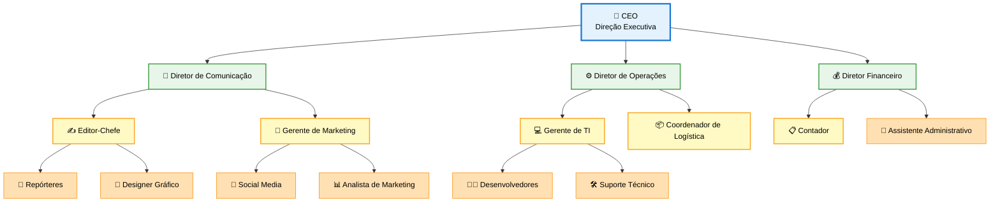

# 🏢 Estrutura Organizacional

## Organograma da Empresa

### Legenda de Cores

| Cor | Nível | Descrição |
|-----|-------|-----------|
| 🔵 **Azul** | Estratégico | CEO - Alta Direção |
| 🟢 **Verde** | Tático | Diretores - Gestão Estratégica |
| 🟡 **Amarelo** | Gerencial | Gerentes e Coordenadores |
| 🟠 **Laranja** | Operacional | Equipe Técnica e Operacional |

---

## 👥 Descrição dos Cargos

### 🔷 Nível Estratégico

#### 👔 CEO - Direção Executiva

**Responsabilidades:**

- Definir a visão estratégica e direção da empresa
- Tomar decisões corporativas de alto impacto
- Representar a empresa junto a stakeholders
- Garantir a sustentabilidade financeira e operacional

**Perfil:** Visão de negócio, liderança inspiradora, conhecimento do setor têxtil

---

### 🔶 Nível Tático (Diretoria)

#### 📢 Diretor de Comunicação

**Responsabilidades:**

- Supervisionar toda a produção editorial e estratégia de comunicação
- Gerenciar relacionamento com anunciantes e parceiros
- Garantir qualidade e consistência editorial
- Liderar equipe de conteúdo e marketing

**Áreas sob gestão:** Redação, Marketing Digital, Design

---

#### ⚙️ Diretor de Operações

**Responsabilidades:**

- Gerenciar infraestrutura tecnológica e operacional
- Otimizar processos internos
- Coordenar logística de eventos e distribuição
- Liderar transformação digital

**Áreas sob gestão:** TI, Logística, Infraestrutura

---

#### 💰 Diretor Financeiro

**Responsabilidades:**

- Planejar e controlar o orçamento da empresa
- Gestão financeira e contábil
- Análise de investimentos e rentabilidade
- Compliance fiscal e tributário

**Áreas sob gestão:** Contabilidade, Administrativo, Financeiro

---

### 🔹 Nível Operacional

#### ✍️ Editor-Chefe

**Responsabilidades:**

- Definir pautas e linha editorial
- Revisar e aprovar conteúdo antes da publicação
- Gerenciar equipe de jornalistas e repórteres
- Garantir qualidade e prazos editoriais

**Reports to:** Diretor de Comunicação

---

#### 📰 Repórteres

**Responsabilidades:**

- Produzir matérias e reportagens sobre o setor têxtil
- Realizar entrevistas e coberturas
- Pesquisar tendências e novidades do mercado
- Manter relacionamento com fontes

**Reports to:** Editor-Chefe

---

#### 🎨 Designer Gráfico

**Responsabilidades:**

- Criar identidade visual das publicações
- Diagramar revista e materiais digitais
- Produzir infográficos e elementos visuais
- Manter consistência da marca

**Reports to:** Editor-Chefe

---

#### 📱 Gerente de Marketing

**Responsabilidades:**

- Desenvolver estratégias de marketing digital
- Gerenciar campanhas publicitárias
- Analisar métricas e ROI
- Coordenar equipe de marketing

**Reports to:** Diretor de Comunicação

---

#### 📲 Social Media

**Responsabilidades:**

- Gerenciar redes sociais da empresa
- Criar conteúdo para plataformas digitais
- Engajar com a audiência
- Monitorar tendências e métricas

**Reports to:** Gerente de Marketing

---

#### 💻 Gerente de TI

**Responsabilidades:**

- Gerenciar infraestrutura tecnológica
- Desenvolver e manter site e sistemas
- Garantir segurança da informação
- Liderar projetos de tecnologia

**Reports to:** Diretor de Operações

---

#### 👨‍💻 Desenvolvedores

**Responsabilidades:**

- Desenvolver e manter plataformas digitais
- Implementar novos recursos e funcionalidades
- Corrigir bugs e otimizar performance
- Documentar código e processos

**Reports to:** Gerente de TI

---

#### 📋 Contador

**Responsabilidades:**

- Realizar escrituração contábil
- Elaborar demonstrativos financeiros
- Cuidar de obrigações fiscais e tributárias
- Assessorar decisões financeiras

**Reports to:** Diretor Financeiro

---

## 📊 Composição da Equipe

| Nível | Quantidade | Área |
|-------|-----------|------|
| **Estratégico** | 1 | CEO |
| **Tático** | 3 | Diretores |
| **Operacional** | 10-15 | Equipe técnica e operacional |

---