# 🏢 Estrutura Organizacional

## Hierarquia

- [**👔 CEO**](#ceo---direcao-executiva) - Direção Executiva
-    - [**📢 Diretor de Comunicação**](#diretor-de-comunicacao)
        - [✍️ Editor-Chefe](#editor-chefe)
            - [📰 Colaboradores / Repórteres](#colaboradores-reporteres)
            - [🎨 Designer Gráfico](#designer-grafico)
        - [📱 Gerente de Marketing](#gerente-de-marketing)
            - [📲 Social Media](#social-media)
            - [📊 Analista de Marketing](#analista-de-marketing)
        - [💼 Gerente de Vendas](#gerente-de-vendas)
            - [🤝 Executivo de Contas](#executivo-de-contas)
    - [**⚙️ Diretor de Operações**](#diretor-de-operacoes)
        - [💻 Gerente de TI](#gerente-de-ti)
            - [👨‍💻 Desenvolvedores](#desenvolvedores)
            - [🛠️ Suporte Técnico](#suporte-tecnico)
        - [📦 Coord. Logística](#coordenador-de-logistica)
    - [**💰 Diretor Financeiro**](#diretor-financeiro)
        - [📋 Contador](#contador)
        - [📄 Assistente Administrativo](#assistente-administrativo)

---

## Organograma Visual

```mermaid
graph TD
    CEO[👔 CEO]
    
    CEO --> COM[📢 Dir. Comunicação]
    CEO --> OPS[⚙️ Dir. Operações]
    CEO --> FIN[💰 Dir. Financeiro]
    
    COM --> EDI[✍️ Editor-Chefe]
    COM --> MKT[📱 Ger. Marketing]
    COM --> VEN[💼 Ger. Vendas]
    
    EDI --> REP1[📰 Colaboradores / Repórteres]
    EDI --> DES[🎨 Designer]
    
    MKT --> SOC[📲 Social Media]
    MKT --> ADS[📊 Analista Mkt]
    
    VEN --> EXE[🤝 Exec. Contas]
    
    OPS --> TEC[💻 Ger. TI]
    OPS --> LOG[📦 Coord. Log.]
    
    TEC --> DEV[👨‍💻 Devs]
    TEC --> SUP[🛠️ Suporte]
    
    FIN --> CONT[📋 Contador]
    FIN --> ADM[📄 Assist. Admin]
    
    %% Nível Estratégico - Azul
    style CEO fill:#e3f2fd,stroke:#1976d2,stroke-width:3px,color:#000
    
    %% Nível Tático - Verde
    style COM fill:#e8f5e9,stroke:#43a047,stroke-width:2px,color:#000
    style OPS fill:#e8f5e9,stroke:#43a047,stroke-width:2px,color:#000
    style FIN fill:#e8f5e9,stroke:#43a047,stroke-width:2px,color:#000
    
    %% Nível Gerencial - Amarelo
    style EDI fill:#fff9c4,stroke:#f9a825,stroke-width:2px,color:#000
    style MKT fill:#fff9c4,stroke:#f9a825,stroke-width:2px,color:#000
    style VEN fill:#fff9c4,stroke:#f9a825,stroke-width:2px,color:#000
    style TEC fill:#fff9c4,stroke:#f9a825,stroke-width:2px,color:#000
    style LOG fill:#fff9c4,stroke:#f9a825,stroke-width:2px,color:#000
    style CONT fill:#fff9c4,stroke:#f9a825,stroke-width:2px,color:#000
    
    %% Nível Operacional - Laranja
    style REP1 fill:#ffe0b2,stroke:#fb8c00,stroke-width:1px,color:#000
    style DES fill:#ffe0b2,stroke:#fb8c00,stroke-width:1px,color:#000
    style SOC fill:#ffe0b2,stroke:#fb8c00,stroke-width:1px,color:#000
    style ADS fill:#ffe0b2,stroke:#fb8c00,stroke-width:1px,color:#000
    style EXE fill:#ffe0b2,stroke:#fb8c00,stroke-width:1px,color:#000
    style DEV fill:#ffe0b2,stroke:#fb8c00,stroke-width:1px,color:#000
    style SUP fill:#ffe0b2,stroke:#fb8c00,stroke-width:1px,color:#000
    style ADM fill:#ffe0b2,stroke:#fb8c00,stroke-width:1px,color:#000
```

### Legenda

| Cor | Nível |
|-----|-------|
| 🔵 Azul | Estratégico |
| 🟢 Verde | Tático |
| 🟡 Amarelo | Gerencial |
| 🟠 Laranja | Operacional |

---

## 👥 Descrição dos Cargos

### 🔷 Nível Estratégico

#### 👔 CEO - Direção Executiva

**Responsabilidades:**

- Definir a visão estratégica e direção da empresa
- Tomar decisões corporativas de alto impacto
- Representar a empresa junto a stakeholders
- Garantir a sustentabilidade financeira e operacional

**Perfil:** Visão de negócio, liderança inspiradora, conhecimento do setor têxtil

---

### 🔶 Nível Tático (Diretoria)

#### 📢 Diretor de Comunicação

**Responsabilidades:**

- Supervisionar toda a produção editorial e estratégia de comunicação
- Gerenciar relacionamento com anunciantes e parceiros
- Garantir qualidade e consistência editorial
- Liderar equipe de conteúdo e marketing

**Áreas sob gestão:** Redação, Marketing Digital, Design

---

#### ⚙️ Diretor de Operações

**Responsabilidades:**

- Gerenciar infraestrutura tecnológica e operacional
- Otimizar processos internos
- Coordenar logística de eventos e distribuição
- Liderar transformação digital

**Áreas sob gestão:** TI, Logística, Infraestrutura

---

#### 💰 Diretor Financeiro

**Responsabilidades:**

- Planejar e controlar o orçamento da empresa
- Gestão financeira e contábil
- Análise de investimentos e rentabilidade
- Compliance fiscal e tributário

**Áreas sob gestão:** Contabilidade, Administrativo, Financeiro

---

### 🔹 Nível Operacional

#### ✍️ Editor-Chefe

**Responsabilidades:**

- Definir pautas e linha editorial
- Revisar e aprovar conteúdo antes da publicação
- Gerenciar equipe de jornalistas e repórteres
- Garantir qualidade e prazos editoriais

**Reports to:** Diretor de Comunicação

---

#### 📰 Colaboradores / Repórteres {#colaboradores-reporteres}

**Responsabilidades:**

- Produzir matérias e reportagens sobre o setor têxtil
- Realizar entrevistas e coberturas
- Pesquisar tendências e novidades do mercado
- Manter relacionamento com fontes

**Reports to:** Editor-Chefe

---

#### 🎨 Designer Gráfico

**Responsabilidades:**

- Criar identidade visual das publicações
- Diagramar revista e materiais digitais
- Produzir infográficos e elementos visuais
- Manter consistência da marca

**Reports to:** Editor-Chefe

---

#### 📱 Gerente de Marketing

**Responsabilidades:**

- Desenvolver estratégias de marketing digital
- Gerenciar campanhas publicitárias
- Analisar métricas e ROI
- Coordenar equipe de marketing

**Reports to:** Diretor de Comunicação

---

#### 📲 Social Media

**Responsabilidades:**

- Gerenciar redes sociais da empresa
- Criar conteúdo para plataformas digitais
- Engajar com a audiência
- Monitorar tendências e métricas

**Reports to:** Gerente de Marketing

---

#### � Analista de Marketing

**Responsabilidades:**

- Analisar métricas e KPIs de campanhas
- Elaborar relatórios de performance
- Pesquisar mercado e concorrência
- Apoiar estratégias de marketing digital

**Reports to:** Gerente de Marketing

---

#### 💼 Gerente de Vendas

**Responsabilidades:**

- Desenvolver estratégias comerciais
- Gerenciar carteira de anunciantes
- Negociar contratos publicitários
- Atingir metas de receita

**Reports to:** Diretor de Comunicação

---

#### 🤝 Executivo de Contas

**Responsabilidades:**

- Prospectar novos anunciantes
- Manter relacionamento com clientes
- Elaborar propostas comerciais
- Acompanhar entregas e satisfação

**Reports to:** Gerente de Vendas

---

#### � Gerente de TI

**Responsabilidades:**

- Gerenciar infraestrutura tecnológica
- Desenvolver e manter site e sistemas
- Garantir segurança da informação
- Liderar projetos de tecnologia

**Reports to:** Diretor de Operações

---

#### 👨‍💻 Desenvolvedores

**Responsabilidades:**

- Desenvolver e manter plataformas digitais
- Implementar novos recursos e funcionalidades
- Corrigir bugs e otimizar performance
- Documentar código e processos

**Reports to:** Gerente de TI

---

#### 🛠️ Suporte Técnico

**Responsabilidades:**

- Atender chamados de suporte interno
- Manter equipamentos e sistemas funcionando
- Auxiliar usuários com problemas técnicos
- Documentar soluções e procedimentos

**Reports to:** Gerente de TI

---

#### 📦 Coordenador de Logística

**Responsabilidades:**

- Coordenar distribuição da revista impressa
- Gerenciar estoque de materiais
- Organizar logística de eventos
- Controlar entregas e prazos

**Reports to:** Diretor de Operações

---

#### 📋 Contador

**Responsabilidades:**

- Realizar escrituração contábil
- Elaborar demonstrativos financeiros
- Cuidar de obrigações fiscais e tributárias
- Assessorar decisões financeiras

**Reports to:** Diretor Financeiro

---

#### 📄 Assistente Administrativo

**Responsabilidades:**

- Apoiar rotinas administrativas e financeiras
- Organizar documentos e arquivos
- Auxiliar em processos de compras
- Atender fornecedores e parceiros

**Reports to:** Diretor Financeiro

---

## 📊 Composição da Equipe

| Nível | Quantidade | Área |
|-------|-----------|------|
| **Estratégico** | 1 | CEO |
| **Tático** | 3 | Diretores |
| **Operacional** | 10-15 | Equipe técnica e operacional |

---