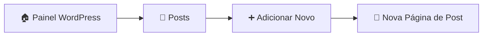
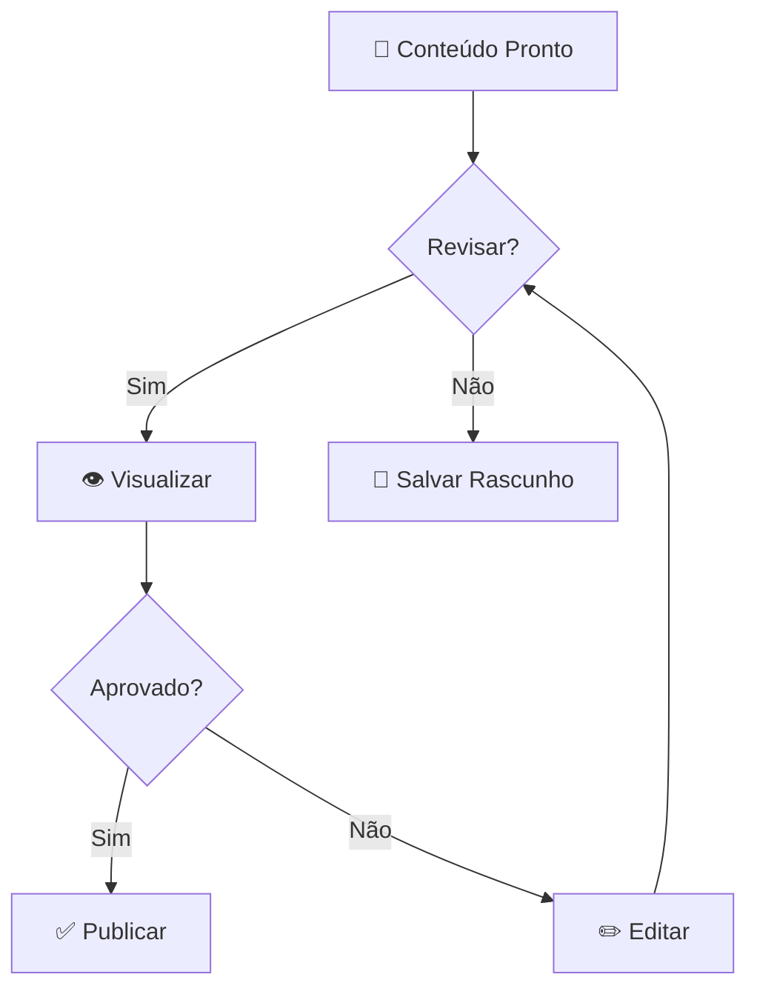

# 📰 Publicar Notícias no Site

!!! info "Perfil: Autor"
    Este guia é destinado a usuários com perfil de **Autor** no WordPress.

[:material-arrow-left: Voltar para Central de Publicações](central-publicacoes.md)

---

## 📋 Passo a Passo

### :material-numeric-1-circle:{ .lg } Passo 1: Acessar a Área de Posts

??? example "Como navegar até Posts"
    1. No painel de controle do WordPress
    2. Na **barra lateral esquerda**, localize o menu
    3. Clique em **"Posts"**
    4. Clique em **"Adicionar Novo"**

| Ação | Localização | Ícone |
|------|-------------|-------|
| **Posts** | Barra lateral esquerda | :material-file-document: |
| **Adicionar Novo** | Submenu de Posts | :material-plus-circle: |

---

### :material-numeric-3-circle:{ .lg } Passo 3: Usar o Construtor Divi

!!! warning "Importante"
    Ao abrir a página de criação do post, **clique em "Usar o Construtor Divi"** para ter acesso a todas as ferramentas de edição visual.

??? success "Interface do Construtor Divi"
    O construtor Divi oferece uma interface visual moderna e intuitiva para criar conteúdo rico e bem formatado.

#### Elementos da Página de Criação

| Elemento | Localização | Função |
|----------|-------------|--------|
| **Título do Post** | Parte superior | Inserir o título da notícia |
| **Área de Conteúdo** | Centro da página | Adicionar texto, imagens e mídia |
| **Opções de Publicação** | Barra lateral direita | Publicar, agendar ou salvar rascunho |
| **Formato do Post** | Barra lateral direita | Escolher tipo de formato |
| **Categorias** | Barra lateral direita | Classificar a notícia |

---

### :material-numeric-4-circle:{ .lg } Passo 4: Preencher o Conteúdo

??? abstract "Estrutura Recomendada para Notícias"
    
    **Título:** Claro, objetivo e atrativo (máx. 70 caracteres)
    
    **Subtítulo:** Complementa o título com informação adicional
    
    **Lead:** Primeiro parágrafo com as informações principais (Quem, O quê, Quando, Onde, Por quê)
    
    **Corpo:** Desenvolvimento da notícia com detalhes e citações
    
    **Imagens:** Fotos relevantes com legendas e créditos

#### Checklist de Conteúdo

- [ ] Título preenchido
- [ ] Conteúdo adicionado
- [ ] Imagens inseridas com créditos
- [ ] Categoria selecionada
- [ ] Tags adicionadas (se aplicável)
- [ ] Revisão ortográfica feita

---

### :material-numeric-5-circle:{ .lg } Passo 5: Selecionar a Categoria

!!! info "Categorias Disponíveis"
    Selecione a categoria apropriada na **barra lateral direita** para classificar corretamente sua notícia.

| Categoria | Tipo de Conteúdo |
|-----------|------------------|
| **Notícias** | Informações gerais do setor |
| **Eventos** | Feiras, congressos e encontros |
| **Tecnologia** | Inovações e tendências tecnológicas |
| **Sustentabilidade** | Práticas sustentáveis na indústria |
| **Mercado** | Análises e dados de mercado |
| **Entrevistas** | Conversas com profissionais do setor |

---

### :material-numeric-6-circle:{ .lg } Passo 6: Publicar a Notícia

??? success "Opções de Publicação"
    
    Na **barra lateral direita**, você encontrará as seguintes opções:
    
    - **Publicar:** Publica imediatamente no site
    - **Salvar Rascunho:** Salva sem publicar
    - **Visualizar:** Pré-visualiza como ficará no site
    - **Agendar:** Define data/hora futura para publicação

!!! tip "Recomendação"
    Sempre use a opção **"Visualizar"** antes de publicar para verificar como a notícia aparecerá para os leitores.

---

## ✏️ Editar Posts Existentes

??? example "Como editar um post já publicado"
    
    1. Acesse **Posts** na barra lateral
    2. Localize o post desejado na lista
    3. Passe o mouse sobre o título
    4. Clique em **"Editar"** (aparece abaixo do título)
    5. Faça as alterações necessárias
    6. Clique em **"Atualizar"** para salvar

| Ação | Descrição |
|------|-----------|
| :material-pencil: **Editar** | Abre o post para edição |
| :material-eye: **Ver** | Visualiza o post publicado |
| :material-delete: **Lixeira** | Move o post para a lixeira |
| :material-content-copy: **Duplicar** | Cria uma cópia do post |

---

## 🗑️ Excluir Posts

!!! danger "Atenção"
    Posts excluídos vão para a **Lixeira** e podem ser recuperados em até 30 dias. Após esse período, são excluídos permanentemente.

??? warning "Como excluir um post"
    
    1. Acesse **Posts** na barra lateral
    2. Localize o post desejado
    3. Passe o mouse sobre o título
    4. Clique em **"Lixeira"**

---

## 📊 Resumo das Ações

| Ação | Caminho | Resultado |
|------|---------|-----------|
| **Criar Post** | Posts → Adicionar Novo | Nova notícia |
| **Editar Post** | Posts → [Post] → Editar | Modificar existente |
| **Excluir Post** | Posts → [Post] → Lixeira | Remover notícia |
| **Visualizar** | Posts → [Post] → Ver | Pré-visualização |
| **Publicar** | Editor → Publicar | Notícia online |

---

## ❓ Dúvidas Frequentes

??? question "Posso agendar uma publicação para o futuro?"
    Sim! Na área de publicação, clique em **"Editar"** ao lado de "Publicar imediatamente" e defina a data e hora desejadas.

??? question "Como adicionar imagens ao post?"
    No construtor Divi, use o módulo de **Imagem** ou arraste a imagem diretamente para a área de conteúdo.

??? question "Posso salvar um rascunho e continuar depois?"
    Sim! Clique em **"Salvar Rascunho"** a qualquer momento. O post ficará salvo em Posts → Rascunhos.

---

[:material-arrow-left: Voltar para Central de Publicações](central-publicacoes.md)
