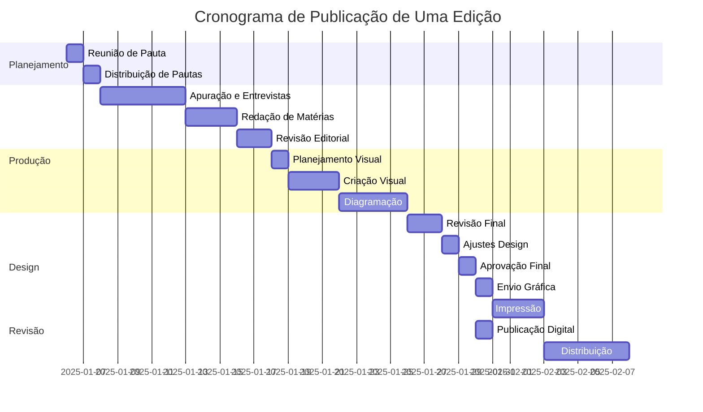

# 📖 Publicação de uma Edição

Esta seção detalha o **fluxo completo de trabalho** para publicar uma edição da Revista Têxtil, do planejamento à distribuição.

## Processo Completo: 

---

### 📅 **FASE 1: Planejamento (Semana 1)**

#### Passo 1.1: Reunião de Pauta
**👤 Responsável:** Editor-Chefe + Diretor de Comunicação  
**⏱️ Duração:** 2 horas  
**📋 Atividades:**
- Definir tema central da edição
- Listar matérias principais (capa, especiais, seções fixas)
- Aprovar calendário de produção
- Definir anunciantes e espaços publicitários

**✅ Entrega:** Documento com pautas aprovadas e distribuição de tarefas

---

#### Passo 1.2: Distribuição de Pautas
**👤 Responsável:** Editor-Chefe  
**⏱️ Duração:** 1 dia  
**📋 Atividades:**
- Distribuir pautas entre os Repórteres
- Definir deadlines para cada matéria
- Briefar equipe sobre expectativas e formato
- Enviar lista de necessidades para Designer (fotos, infográficos)

**✅ Entrega:** Pautas distribuídas com deadlines claros

---

### ✍️ **FASE 2: Produção de Conteúdo (Semanas 2-3)**

#### Passo 2.1: Apuração e Entrevistas
**👤 Responsável:** Repórteres  
**⏱️ Duração:** 3-5 dias por matéria  
**📋 Atividades:**
- Pesquisar sobre o tema
- Contatar e agendar entrevistas
- Realizar entrevistas
- Coletar fotos, dados e materiais
- Solicitar autorização de uso de imagem

**✅ Entrega:** Material apurado (entrevistas, fotos, dados)

---

#### Passo 2.2: Redação das Matérias
**👤 Responsável:** Repórteres  
**⏱️ Duração:** 2-3 dias por matéria  
**📋 Atividades:**
- Escrever matéria seguindo padrão editorial
- Incluir citações e dados coletados
- Sugerir títulos e subtítulos
- Revisar texto antes de entregar
- Entregar ao Editor-Chefe no prazo

**✅ Entrega:** Matérias em formato .docx + fotos em alta resolução

---

#### Passo 2.3: Revisão Editorial
**👤 Responsável:** Editor-Chefe  
**⏱️ Duração:** 1-2 dias  
**📋 Atividades:**
- Ler todas as matérias recebidas
- Avaliar qualidade, profundidade e aderência à pauta
- Solicitar ajustes e complementações aos Repórteres
- Revisar ortografia, gramática e estilo
- Aprovar títulos e subtítulos
- Definir ordem das matérias na edição

**✅ Entrega:** Matérias aprovadas e organizadas

---

### 🎨 **FASE 3: Criação Visual (Semana 3)**

#### Passo 3.1: Planejamento Visual
**👤 Responsável:** Designer Gráfico + Editor-Chefe  
**⏱️ Duração:** 1 dia  
**📋 Atividades:**
- Definir conceito visual da edição
- Escolher paleta de cores
- Planejar distribuição de conteúdo (páginas)
- Identificar necessidade de infográficos
- Criar layout da capa

**✅ Entrega:** Wireframe/esboço da edição + layout de capa

---

#### Passo 3.2: Criação de Elementos Visuais
**👤 Responsável:** Designer Gráfico  
**⏱️ Duração:** 2-3 dias  
**📋 Atividades:**
- Criar infográficos e ilustrações
- Tratar e ajustar fotos
- Desenvolver boxes e destaques
- Criar elementos decorativos
- Preparar anúncios publicitários

**✅ Entrega:** Elementos visuais prontos para diagramação

---

#### Passo 3.3: Diagramação da Edição
**👤 Responsável:** Designer Gráfico  
**⏱️ Duração:** 3-4 dias  
**📋 Atividades:**
- Diagramar todas as matérias da edição
- Inserir textos, fotos e elementos visuais
- Ajustar espaçamentos e hierarquia visual
- Revisar consistência de fontes e cores
- Inserir anúncios publicitários nas páginas corretas
- Criar índice/sumário
- Verificar paginação e sangrias

**✅ Entrega:** Edição diagramada em PDF para revisão

---

### 🔍 **FASE 4: Revisão e Ajustes (Semana 4)**

#### Passo 4.1: Revisão Final de Texto
**👤 Responsável:** Editor-Chefe  
**⏱️ Duração:** 1-2 dias  
**📋 Atividades:**
- Revisar todos os textos no layout diagramado
- Verificar erros de digitação ou diagramação
- Checar nomes, cargos e dados
- Validar títulos, legendas e créditos
- Solicitar correções ao Designer se necessário

**✅ Entrega:** Lista de correções para o Designer

---

#### Passo 4.2: Ajustes de Design
**👤 Responsável:** Designer Gráfico  
**⏱️ Duração:** 1 dia  
**📋 Atividades:**
- Implementar correções solicitadas
- Revisar todas as páginas
- Verificar qualidade de imagens (300 dpi para impressão)
- Conferir sangrias e margens
- Gerar PDF final em alta resolução

**✅ Entrega:** PDF final da edição

---

#### Passo 4.3: Aprovação Final
**👤 Responsável:** Diretor de Comunicação + Editor-Chefe  
**⏱️ Duração:** Meio dia  
**📋 Atividades:**
- Revisar PDF completo da edição
- Validar conteúdo e qualidade visual
- Aprovar para produção
- Assinar termo de aprovação

**✅ Entrega:** Edição aprovada e liberada para produção

---

### 🖨️ **FASE 5: Produção e Distribuição (Semana 5)**

#### Passo 5.1: Envio para Gráfica
**👤 Responsável:** Coordenador de Logística + Designer Gráfico  
**⏱️ Duração:** 1 dia  
**📋 Atividades:**
- Converter PDF para padrão de impressão (CMYK, sangria)
- Enviar arquivo para gráfica parceira
- Confirmar recebimento e especificações técnicas
- Acompanhar produção da prova de cor
- Aprovar prova impressa

**✅ Entrega:** Arquivo enviado e prova aprovada

---

#### Passo 5.2: Impressão
**👤 Responsável:** Gráfica (acompanhado por Coordenador de Logística)  
**⏱️ Duração:** 2-3 dias  
**📋 Atividades:**
- Impressão da tiragem completa
- Controle de qualidade (amostragem)
- Acabamento (dobra, grampo, corte)
- Embalagem dos exemplares

**✅ Entrega:** Exemplares impressos e embalados

---

#### Passo 5.3: Publicação Digital
**👤 Responsável:** Desenvolvedores + Social Media  
**⏱️ Duração:** 1 dia  
**📋 Atividades:**
- Converter edição para formato digital (PDF interativo ou flipbook)
- Publicar no site da revista
- Enviar newsletter para assinantes
- Publicar nas redes sociais anunciando nova edição
- Disponibilizar em plataformas digitais (se aplicável)

**✅ Entrega:** Edição digital disponível online

---

#### Passo 5.4: Distribuição Física
**👤 Responsável:** Coordenador de Logística  
**⏱️ Duração:** 3-5 dias  
**📋 Atividades:**
- Retirar exemplares na gráfica
- Organizar lotes por destino (assinantes, pontos de venda, eventos)
- Contratar transportadora ou Correios
- Embalar e etiquetar remessas
- Enviar exemplares para assinantes
- Distribuir em bancas e pontos de venda
- Controlar estoque de exemplares

**✅ Entrega:** Edição distribuída para todos os destinos

---

### 📊 **FASE 6: Pós-Publicação (Semana 6)**

#### Passo 6.1: Análise de Performance
**👤 Responsável:** Analista de Marketing  
**⏱️ Duração:** Contínuo (primeiros 15 dias)  
**📋 Atividades:**
- Monitorar acessos à edição digital
- Acompanhar engajamento em redes sociais
- Coletar feedback de leitores
- Medir taxa de abertura de newsletters
- Analisar vendas em bancas

**✅ Entrega:** Relatório de performance da edição

---

#### Passo 6.2: Reunião de Retrospectiva
**👤 Responsável:** Toda equipe (facilitada pelo Editor-Chefe)  
**⏱️ Duração:** 1 hora  
**📋 Atividades:**
- Discutir o que funcionou bem
- Identificar gargalos e problemas
- Coletar sugestões de melhoria
- Documentar lições aprendidas
- Planejar ajustes para próxima edição

**✅ Entrega:** Documento com melhorias para próximo ciclo

---

### 📈 Cronograma Visual do Processo

---

### 🎯 Pontos Críticos de Controle

| Checkpoint | Responsável | Critério de Qualidade |
|------------|-------------|----------------------|
| **Aprovação de Pautas** | Editor-Chefe | Relevância, viabilidade, alinhamento estratégico |
| **Entrega de Matérias** | Repórteres | Prazo, qualidade, completude |
| **Aprovação Editorial** | Editor-Chefe | Aderência à pauta, qualidade do texto |
| **Layout de Capa** | Diretor de Comunicação | Apelo visual, representação do conteúdo |
| **PDF Final** | Editor-Chefe | Zero erros, qualidade visual |
| **Aprovação Gráfica** | Coord. Logística | Qualidade de impressão, cores corretas |
| **Distribuição** | Coord. Logística | Entrega no prazo, exemplares em perfeito estado |

---